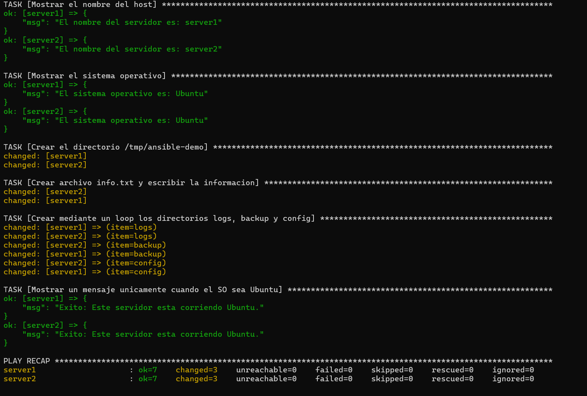

# 🚀 Laboratorio: Administración de Servidores Linux con Ansible y Docker

Este repositorio contiene la segunda práctica de automatización de infraestructura. 

## 🎯 Objetivo de la práctica
Crear un laboratorio local con dos servidores Linux utilizando Docker (basados en la imagen de Ubuntu 24.04) y administrarlos de forma centralizada utilizando Ansible mediante una conexión directa (`ansible_connection=docker`). La automatización incluye la recolección de información del sistema, creación de directorios en bucle y validación de condiciones del sistema operativo.

## 🐳 Comandos para iniciar los contenedores
Para levantar la infraestructura de los dos servidores, asegúrate de tener Docker Desktop ejecutándose e ingresa el siguiente comando en la terminal:
\`\`\`bash
docker compose up -d
\`\`\`

*(Nota: Los contenedores requieren tener Python 3 instalado para que Ansible pueda ejecutar sus módulos correctamente).*

## 🤖 Comando para ejecutar el Playbook
Para iniciar la automatización en ambos servidores, ejecuta el siguiente comando desde una terminal de Linux (WSL):
\`\`\`bash
ANSIBLE_REMOTE_TMP=/tmp/ansible ansible-playbook -i inventory.ini playbook.yml
\`\`\`

## 📸 Captura de pantalla de la ejecución exitosa
A continuación se muestra la evidencia de la ejecución del playbook donde se completan todas las tareas (lectura de host, creación de directorio temporal, escritura del archivo `info.txt` y creación del loop de carpetas) sin errores (`failed=0`):

---
*Desarrollado por Aliandy L. Jiménez Vicente.*
